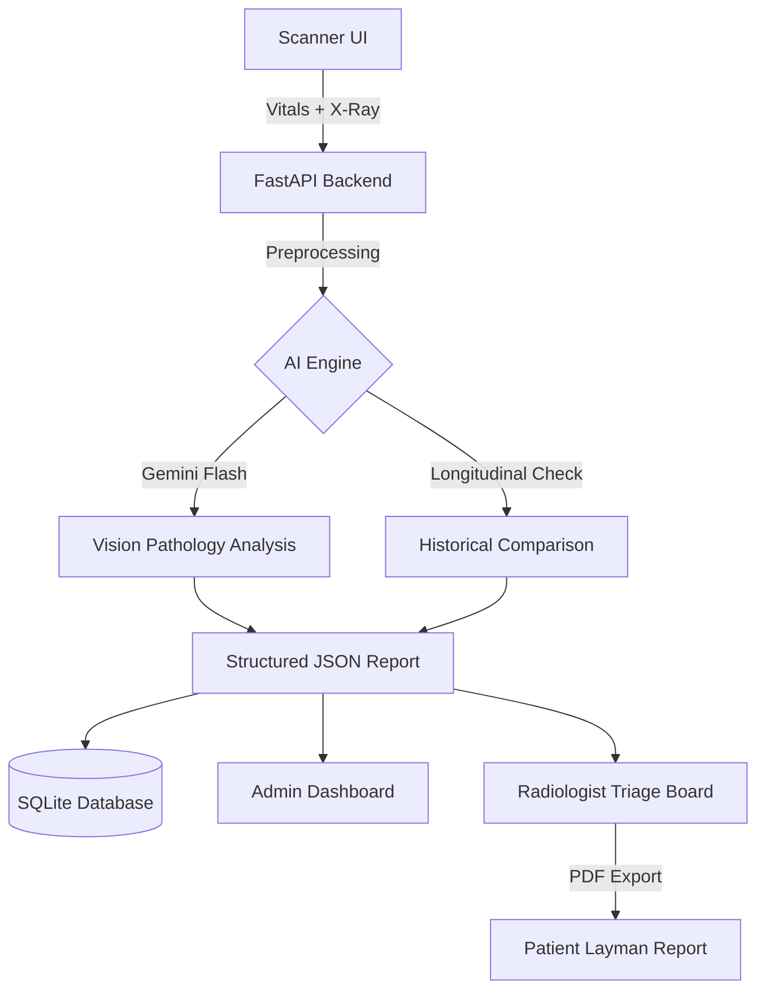

# Med-AI Clinical Decision Support System (CDSS) V6 Ultimate

[](https://fastapi.tiangolo.com/)
[](https://reactjs.org/)
[](https://aistudio.google.com/)
[](LICENSE)

An industrial-grade, full-stack Clinical Decision Support System (CDSS) designed to revolutionize radiologist workflows. By correlating multi-modal data points—including Chest X-rays, real-time vitals, and longitudinal patient history—Med-AI provides high-fidelity diagnostic suggestions with clinical precision.

---

## 🏗️ System Architecture



## 🌟 Key Features

### 1. **Advanced AI Intelligence**
*   **Vision & Pathology Extraction**: High-accuracy detection of lung fractures, viral pneumonitis, cardiomegaly, effusions, and more via the Gemini-Vision pipeline.
*   **Dual-Role Persona Engine**: Automatically branches diagnostic output into two distinct perspectives:
    *   **Clinical (The Radiologist)**: High-level technical terminology for professional verification.
    *   **Patient (The Layman)**: Simplified, compassionate explanations with actionable follow-up steps.
*   **Contextual Co-Pilot Chat**: Integrated interactive LLM window on reports for specific radiologist inquiries regarding the scan.

### 2. **Clinical Safeguards & EHR Correlation**
*   **Vitals Correlator**: Dynamically cross-references visual pathologies with patient vitals (Temperature, BP, Symptoms) to reduce false positives.
*   **Sanity-Check Safeguards**: Automatically identifies medically impossible inputs (e.g., zero temperature) and flags critical monitoring errors or shock states.
*   **Longitudinal Progression**: The system natively detects returning patients and forces the AI to perform a comparative analysis (Improved vs. Worsened) against previous scans.

### 3. **Hospital Operations Command Center**
*   **Administrative Telemetry**: Real-time dashboard tracking scan volume, average token latency, and department "Burden Graphs."
*   **Critical Priority Inbox**: A dedicated high-risk triage feed that isolates life-threatening cases for immediate intervention.
*   **Physician Ranking**: Automated leaderboards tracking which internal clinicians are utilizing the system most frequently.

### 4. **Workflow Automation**
*   **Kanban Triage System**: A visual patient management board for routing cases through `Waiting Room`, `Under Review`, and `Discharged` queues.
*   **Zero-Loss Persistence**: Built on a normalized SQLite architecture ensuring zero-config database portability across any machine.
*   **Native PDF & CSV Export**: Generate clinical-grade letterhead reports for patients and Microsoft Excel-compatible clinical data exports for offline research.

---

## 🛠️ Tech Stack

| Layer | Technology |
|---|---|
| **Frontend** | React 18, Vite, Recharts, Lucide Icons, Glassmorphism CSS |
| **Backend** | Python 3.10+, FastAPI, Uvicorn, Dotenv |
| **Database** | SQLite3 (Normalized relational architecture) |
| **AI Models** | Google Gemini 1.5 Flash (Vision & Reasoning) |
| **Styling** | Modern Vanilla CSS (Dark/Light Dynamic Mode) |

---

## 🚀 Getting Started

### 1. Prerequisites
*   **Node.js** (v18+)
*   **Python** (v3.10+)
*   **Gemini API Key** (Free from [Google AI Studio](https://aistudio.google.com/))

### 2. Backend Installation
1.  **Navigate & Install**:
    ```bash
    cd backend
    pip install -r requirements.txt
    ```
2.  **Configure Environment**:
    Create a `.env` file in the `backend/` directory:
    ```env
    GEMINI_API_KEY=YOUR_API_KEY_HERE
    ```
3.  **Launch Server**:
    ```bash
    uvicorn main:app --reload
    ```
    *Backend defaults to: http://127.0.0.1:8000*

### 3. Frontend Installation
1.  **Navigate & Install**:
    ```bash
    cd frontend
    npm install
    ```
2.  **Launch Dev Server**:
    ```bash
    npm run dev
    ```
    *Access the platform at: http://localhost:5173*

---

## 🛡️ Security & Compliance
*   **Multi-Tenancy**: Built-in organization-based scoping ensures hospital data remains siloed and secure.
*   **Human-in-the-Loop**: Exclusive peer-review modules allow human radiologists to append override notes to AI suggestions, ensuring clinical accountability.
*   **Lightweight Design**: No heavy Docker dependencies required for basic operation—ideal for emergency clinic deployment.

---

## 🧩 Troubleshooting

*   **CORS Blocked**: If the frontend cannot reach the API, verify your IP is not being blocked and that `main.py` has the correct `allow_origins`.
*   **Missing Analysis**: Ensure your `GEMINI_API_KEY` is active. Check the backend console for `403` or `429` errors.
*   **Database Issues**: If the dashboard shows no data, ensure you have performed at least one scan to initialize the `pathology.db` tables.

---
*Developed for Excellence in Clinical Decision Support.*

---

## 👨‍💻 About the Developer

**Utkarsh Srivastav**  
*Lead Developer & AI Researcher*

This system was architected and developed as a **Major Final Year Project**, driven by a passion for merging **Artificial Intelligence** with **Healthcare**. The vision behind Med-AI was to move beyond simple image classification and create a true **Clinical Decision Support System** that understands the nuances of patient history, vitals, and long-term health progression.

### 🎯 My Contribution
As the primary developer, I engineered the entire pipeline from the ground up:
*   **AI Architecture**: Designing the Gemini-based multi-modal correlation engine.
- **Backend Engineering**: Implementing the persistent EHR SQLite architecture and organization-based multi-tenancy.
- **Frontend Design**: Crafting the glassmorphic, clinical-grade UI and real-time dashboard analytics.
- **Medical Logic**: Developing the "Longitudinal Tracking" algorithm to simulate real-world radiological comparison.

### 🌐 Connect & Collaborate
I am always open to discussing Medical AI, Full-Stack Engineering, or potential collaborations.

[](https://www.linkedin.com/in/utkarsh-srivastav-b433bb33a)
[](https://github.com/UtkarshSrivastav09/MED-AI-Clinical-Decision-Support-System-Final-Year-Project-)
[](mailto:utkarshsrivastav2206@gmail.com)

---
*Powering the future of Digital Diagnostics.*
