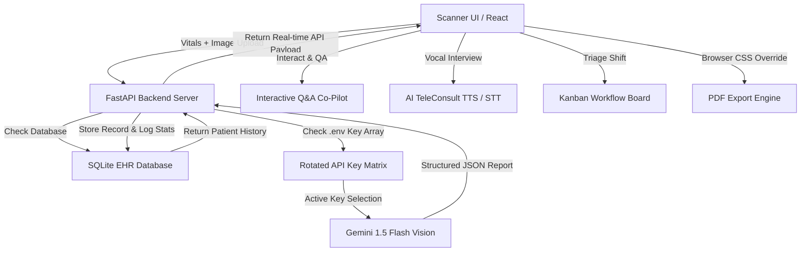

# 🩺 Med-AI Clinical Decision Support System (CDSS)
## 🎓 Final Year Project Presentation, Video Script & Viva Guide

Welcome to the **Med-AI Clinical Decision Support System (CDSS)** presentation manual. This document is custom-tailored to help you present this major final-year project to examiners, interviewers, or record a professional software demonstration video. 

This guide is structured into logical sections that you can open, read, and use directly.

---

## 📋 Table of Contents
1. 💡 **The Elevator Pitches (30-Second vs. 3-Minute)**
2. 🏥 **The Core Problem Statement (Why this was built)**
3. ⚙️ **Under-The-Hood Architecture (System Design)**
4. 🛠️ **Technological Stack & Package Manifest**
5. 🗄️ **Relational Database Blueprint (SQLite Schema)**
6. 🌟 **Feature Deep-Dives (How it works + How to demo it)**
7. 📹 **Step-by-Step Video Walkthrough Script (Screenplay)**
8. 💬 **Top 15 Technical Interview / Viva Q&As**

---

## 1. 💡 The Elevator Pitches

### ⏱️ The 30-Second Pitch (Fast Introduction)
> *"Med-AI is an industrial-grade, full-stack Clinical Decision Support System designed to assist radiologists and clinicians. By correlating multi-modal data points—such as Chest X-rays, real-time vitals, and longitudinal patient history—Med-AI leverages Google's Gemini-Vision pipeline to deliver high-fidelity diagnostic suggestions with clinical precision. It features live AI telemedicine consultations with real-time voice synthesis, a collaborative imaging co-pilot, and a clinical triage Kanban board—all built on a fast, responsive React-FastAPI architecture with persistent SQLite multi-tenancy."*

### ⏱️ The 3-Minute Pitch (Detailed Overview)
> *"Good morning/afternoon, examiners. My final year project is **Med-AI**, a multi-modal Clinical Decision Support System. In modern healthcare, radiologists are overwhelmed, causing diagnostic bottlenecks. Med-AI solves this by functioning as a clinical co-pilot.*
> 
> *Our system is divided into two primary nodes. On the **Backend**, we run a lightweight, high-performance **FastAPI** server that communicates with a **SQLite** database and interfaces with **Google Gemini 1.5 Flash**. On the **Frontend**, we engineered a modern, responsive, glassmorphic **React** interface.*
> 
> *When a patient undergoes scanning, the clinician inputs clinical vitals like Blood Pressure, Temperature, and Symptoms alongside the chest radiograph. Med-AI's core AI pipeline processes these inputs. It validates vitals for clinical sanity, checks the database for returning patient history to conduct longitudinal health progression mapping, and calls the Gemini-Vision engine using a rotating API key matrix to bypass quota limits.*
> 
> *The AI generates a structured JSON response containing: visual annotation coordinates to overlay diagnostic heatmaps, technical findings for the clinician, and simplified summaries with translation capabilities and an actionable treatment timeline for the patient. Radiologists can review the scans on a triage Kanban board, log manual peer-review overrides to maintain human accountability, chat with an imaging co-pilot, and export a clean print-optimized hospital-letterhead PDF report.*
> 
> *Additionally, Med-AI implements **AI TeleConsult**, a real-time virtual clinic lobby with patient webcam access, web speech-synthesis for vocal AI assistance, and speech-recognition enabling patients to describe symptoms vocally. This forms a complete digital diagnostic ecosystem."*

---

## 2. 🏥 The Core Problem Statement

When explaining this project, emphasize *why* it was built. Do not just say "it's an AI scanner." Instead, position it as a solution to these industry problems:

1. **Radiologist Overload & Delay**: The standard turnaround time (SLA) for a radiologist to review an X-ray is 24 to 48 hours. Med-AI processes scans in less than 2 seconds (average latency under 2000ms), prioritizing critical cases instantly.
2. **Visual-Only Diagnostic Errors**: Standard AI models classify images without context. A lung shadow could be pneumonia or simply a healthy lung in an elderly patient. Med-AI cross-references visual anomalies with clinical vitals (BP, temperature, symptoms) to improve accuracy.
3. **Medical Jargon Barrier**: Patients receive reports they cannot read, causing anxiety. Med-AI solves this by generating two distinct reports: a high-level **Clinical Report** (medical terms) and a compassionate **Layman Report** (simple language, localized translations, and a structured timeline).
4. **Disjointed Healthcare Workflows**: Most AI tools are static files. Med-AI integrates into hospital operations with a Kanban Triage Board (Waiting Room $\rightarrow$ Doctor Review $\rightarrow$ Discharged) and offline Excel exports (CSV).

---

## 3. ⚙️ Under-The-Hood Architecture

Med-AI is designed as a **decoupled, multi-tenant full-stack system**:



### The Life of a Scan (Data Flow):
1. **Frontend Input**: The doctor enters patient details and uploads an X-ray in [Scanner.jsx](file:///c:/Users/DELL/Downloads/MED-AI-Clinical-Decision-Support-System-Final-Year-Project--main/frontend/src/pages/Scanner.jsx).
2. **Backend Interception**: The FastAPI backend routes the request through `/api/scan` in [main.py](file:///c:/Users/DELL/Downloads/MED-AI-Clinical-Decision-Support-System-Final-Year-Project--main/backend/main.py). It queries the database to see if this patient has a historical scan.
3. **AI Pipeline Execution**: In [ai_service.py](file:///c:/Users/DELL/Downloads/MED-AI-Clinical-Decision-Support-System-Final-Year-Project--main/backend/ai_service.py), the image is resized to a max of $1024 \times 1024$ pixels. A clinical prompt containing the patient’s age, gender, vitals, and previous scan diagnosis is sent to the Gemini 1.5 Flash model.
4. **JSON Structuring**: The prompt mandates a strict JSON layout. A regular expression parser on the backend sanitizes the output, stripping markdown formatting and trailing commas before loading.
5. **EHR Logging**: The parsed diagnosis, severity level (Low, Medium, High, Critical), referrals, and vitals are logged in the SQLite database (`pathology.db`).
6. **Command Dispatch**: The frontend receives the data and updates the Admin Dashboard burden stats, latency charts, and critical priority alerts instantly.

---

## 4. 🛠️ Technological Stack & Package Manifest

Here is the table of technologies and tools used. You can open and read this during your interview:

| Layer | Component | Technical Selection | Purpose / Role |
| :--- | :--- | :--- | :--- |
| **Frontend** | Core framework | **React.js 18** (Vite builder) | Fast, modular component UI with zero build-lag. |
| | Routing | **React Router DOM v6** | Manages protected page paths and transitions. |
| | Data Visualization | **Recharts** | Renders dynamic burden graphs and patient history charts. |
| | Icons | **Lucide React** | Sleek, uniform vector iconography. |
| | PDF Compiler | **html2pdf.js** | Client-side HTML-to-canvas-to-PDF compiler. |
| **Backend** | Core Framework | **Python 3.10+ & FastAPI** | Async execution, automated JSON serialization. |
| | Server Engine | **Uvicorn** | High-concurrency ASGI web server implementation. |
| | Model Gateway | **google-generativeai** | Native SDK interface for Google AI Studio API. |
| | Configurations | **python-dotenv** | Manages environment keys and API rotation states. |
| **Database** | Database Engine | **SQLite3** | Zero-config, persistent relational SQL store. |
| **Styling** | Layout & UI | **Vanilla CSS & Glassmorphism** | Responsive layouts, backdrop-filters, custom grids, and Dark/Light variables. |

---

## 5. 🗄️ Relational Database Blueprint (SQLite Schema)

Med-AI is driven by a normalized, local SQL database configured in [database.py](file:///c:/Users/DELL/Downloads/MED-AI-Clinical-Decision-Support-System-Final-Year-Project--main/backend/database.py). 

### 1. `users` Table (System Security Credentials)
Tracks clinicians who can access their organization's records.
```sql
CREATE TABLE users (
    id INTEGER PRIMARY KEY AUTOINCREMENT,
    username TEXT UNIQUE,
    email TEXT UNIQUE,
    password_hash TEXT,
    created_at TEXT,
    organization TEXT DEFAULT 'Med-AI Global'
);
```

### 2. `patients` Table (Electronic Health Records)
Stores patient clinical profiles, diagnostic history, and AI outputs.
```sql
CREATE TABLE patients (
    id INTEGER PRIMARY KEY AUTOINCREMENT,
    scan_date TEXT,
    patient_name TEXT,
    age INTEGER,
    gender TEXT,
    blood_pressure TEXT,
    temperature TEXT,
    symptoms TEXT,
    referring_doctor TEXT,
    image_name TEXT,
    report_json TEXT, -- Contains raw Gemini structured output
    requires_followup BOOLEAN, -- 1 if severity is High or Critical
    processing_time_ms INTEGER, -- Real-time AI response latency
    department TEXT, -- Automatically parsed specialist routing
    triage_status TEXT, -- 'Waiting Room', 'Doctor Review', 'Discharged'
    human_override_note TEXT, -- Custom comments logged by doctors
    phone TEXT,
    email TEXT,
    organization TEXT DEFAULT 'Med-AI Global' -- Multi-tenancy isolation
);
```

> [!TIP]
> **Multi-Tenancy Isolation Rule**: Both tables contain an `organization` column. This means when a clinician from "Hospital A" logs in, the query `SELECT ... WHERE organization = ?` isolates their view, preventing "Hospital B" from seeing confidential patient records.

---

## 6. 🌟 Feature Deep-Dives

Here are the ten key features of the project, including how they work under the hood and what you can say to explain them:

### 1. Multi-Modal AI Scan Engine
*   **What it is**: A scanner that accepts medical images alongside patient age, gender, vitals, and symptoms.
*   **Under the Hood**: FastAPI routes the image and text metadata to the `analyze_xray` function, which calls the `gemini-flash-latest` model.
*   **Interview Talking Point**: *"Instead of analyzing the image in isolation, our prompt feeds patient context (vitals and symptoms) into the model. This mirrors real-world clinical practice, where a doctor never makes a diagnosis based on an X-ray alone."*

### 2. Dual-Role Persona Output
*   **What it is**: A system that separates diagnostic output into a professional "Clinical" view and a patient-friendly "Layman" view.
*   **Under the Hood**: The Gemini prompt requires a JSON structure with two primary blocks: `clinical_assessment` and `patient_layman_assessment`.
*   **Interview Talking Point**: *"We solve the medical jargon barrier. The doctor sees technical diagnoses and confidence scores, while the patient receives a compassionate explanation and a structured treatment timeline, both accessible on the same dashboard."*

### 3. AI TeleConsult (Virtual Clinic)
*   **What it is**: A real-time telemedicine portal where the AI acts as a virtual physician.
*   **Under the Hood**: Uses `navigator.mediaDevices.getUserMedia` to activate the patient's webcam in a Picture-in-Picture window. It integrates the browser's native `SpeechSynthesis` (TTS) and Web Speech API `SpeechRecognition` (STT) for voice input.
*   **Interview Talking Point**: *"This simulates a remote clinical interview. The patient speaks their symptoms, the AI listens, updates the encrypted chat log, sends the conversation history to our `/api/consult_chat` endpoint, and speaks back with empathetic, structured medical advice."*

### 4. Interactive Imaging AI Co-Pilot
*   **What it is**: An ad-hoc Q&A chat window positioned alongside the patient report.
*   **Under the Hood**: The backend endpoint `/api/chat` passes the clinician's query, the original image, and the scan's filename to the Gemini-Vision engine.
*   **Interview Talking Point**: *"If a radiologist is unsure about an AI suggestion, they do not have to rerun the entire scan. They can use the Co-Pilot Chat to ask specific questions, such as 'Is the fracture spiral or transverse?', and receive an instantaneous verification."*

### 5. Human Oversight Peer Review
*   **What it is**: An override system that allows radiologists to add custom verification notes.
*   **Under the Hood**: Hits `/api/override`, updating the `human_override_note` column in the database for that patient record.
*   **Interview Talking Point**: *"To comply with healthcare software safety standards, we implement a Human-in-the-Loop design. Radiologists can log custom notes to clarify or override the AI’s confidence score. This override is permanently saved in the patient's EHR."*

### 6. Dynamic Clinical Triage Kanban Board
*   **What it is**: A multi-column dashboard to manage hospital workflows.
*   **Under the Hood**: A state-transition dashboard in [Triage.jsx](file:///c:/Users/DELL/Downloads/MED-AI-Clinical-Decision-Support-System-Final-Year-Project--main/frontend/src/pages/Triage.jsx) that transitions patient statuses (`Waiting Room` $\rightarrow$ `Doctor Review` $\rightarrow$ `Discharged`) via `/api/triage/update` requests.
*   **Interview Talking Point**: *"This emulates real-world hospital workflows. Instead of presenting a static list of records, we provide a Kanban board. High-risk patients are highlighted with a pulsing red border based on the AI's severity score, helping doctors triage urgent cases first."*

### 7. Longitudinal Patient History Tracking
*   **What it is**: An interactive graph showing a patient's health trends over time.
*   **Under the Hood**: The patient directory page groups historical scans by patient name and uses `Recharts` to plot a line graph of their severity scores (Low = 25, Medium = 50, High = 75, Critical = 100) across all visits.
*   **Interview Talking Point**: *"If a patient returns for a follow-up scan, our backend automatically retrieves their previous diagnosis and feeds it into the AI prompt. This forces the model to compare the old and new images, stating whether the condition has improved or worsened."*

### 8. Native Hospital PDF Layout Engine
*   **What it is**: A clean, print-ready PDF exporter that formats reports onto a professional hospital letterhead.
*   **Under the Hood**: Uses `html2pdf.js` to target a hidden DOM element (`#premium-report-template`). The print styles hide the dark mode theme, replacing it with a clean black-and-white hospital letterhead featuring clinical seals and signatures.
*   **Interview Talking Point**: *"We built a custom print-CSS engine. When the user exports the report to a PDF, the system hides the tech-heavy interface and renders a clean, professional medical report, complete with a digital verification seal and signature."*

### 9. Multi-Key API Rotation Matrix
*   **What it is**: A backend safeguard that rotates API keys to prevent rate limits.
*   **Under the Hood**: The `ai_service.py` file loads multiple keys (`GEMINI_API_KEY`, `GEMINI_API_KEY_2`, `GEMINI_API_KEY_3`) from the env. If a `429 Rate Limit` or `Quota Exhausted` error is caught, the system automatically rotates to the next key and retries the request.
*   **Interview Talking Point**: *"To ensure high availability in clinical environments, we built an API rotation matrix. If Google limits our request frequency under a free tier key, the backend rotates to an alternate key and retries, ensuring uninterrupted service."*

### 10. EHR Data Exporter (CSV Compiler)
*   **What it is**: An offline data extraction tool.
*   **Under the Hood**: Uses client-side JavaScript to compile SQLite database records into a raw data URI (`data:text/csv`), downloading it as a Microsoft Excel-compatible file.
*   **Interview Talking Point**: *"To support offline medical research and records auditing, clinicians can export the entire database to a structured CSV spreadsheet with a single click, using clean sanitization to escape commas and special characters."*

---

## 7. 📹 Step-by-Step Video Walkthrough Script

Use this screenplay script to record your project demonstration video. It is designed to showcase the system's key features in under 5 minutes.

### Video Scene Setup
*   **Microphone**: Active and clear.
*   **Browser**: Open in Full-Screen mode on `http://localhost:5173`.
*   **Database**: Ensure you have run some test scans beforehand so the dashboard has active telemetry.
*   **Theme**: Dark Mode enabled to highlight the glassmorphic UI.

---

### 🎬 Scene 1: The Intro & The Command Center
*   **Action**: Start on the **Admin Dashboard** page. Hover your cursor over the metrics at the top.
*   **Speak**: 
    > *"Hello everyone. Today, I am demonstrating **Med-AI**, a Clinical Decision Support System designed to assist clinicians and streamline radiology workflows.*
    > 
    > *We are currently looking at the **Hospital Operations Command Center**. The system displays real-time statistics: the total scans processed, the number of diseases identified, and the average token processing latency (which is currently around 1800 milliseconds). Below that, we can see a bar chart showing our Top Referring Doctors and a donut chart showing the Department Burden. There is also a live global feed displaying recent scans, highlighting high-risk cases in red."*

---

### 🎬 Scene 2: The Pathology AI Scanner
*   **Action**: Click **Clinical Imaging** in the sidebar navigation.
*   **Speak**: 
    > *"Next, let's navigate to the **Clinical Imaging Scanner**. Here, we can enter patient records and vitals. I will select an existing patient, 'Arjun Mehta', from our autocomplete database. Notice how the system automatically retrieves his age, gender, and clinical history.*
    > 
    > *For this demo, let's input a body temperature of 101.5°F, a blood pressure of 130/85, and list symptoms of severe chest congestion. Now, I will upload a chest X-ray image and click 'Run AI Diagnosis Verification'."*

---

### 🎬 Scene 3: The Loading State & Report Viewer
*   **Action**: Click the **Scan** button. Let the loading scan line run. Once the report renders, scroll down slowly.
*   **Speak**: 
    > *"While processing, the system shows an active scanning interface. Our FastAPI backend is sending this image and patient vitals to the Google Gemini-Vision pipeline.*
    > 
    > *The scan is complete. On the left side of the report viewer, we can enable the AI heatmap overlay. This shows the bounding box coordinates generated by the model to highlight clinical anomalies.*
    > 
    > *On the right, we have the professional **Technical Diagnoses** listing findings like Viral Pneumonitis. Below that is the **Simplified Patient Summary** written in plain, compassionate language. To make this accessible, patients can click the translation hub to translate the summary into Hindi instantly."*

---

### 🎬 Scene 4: Co-Pilot Chat, Override & PDF Export
*   **Action**: Type a question into the Co-Pilot box: *"Is there any pleural effusion?"* and click Send. Then write a quick note in the Peer Review section: *"AI confidence matches visual consolidation, clear to proceed"* and click Log. Finally, click **Download Premium Patient Report (PDF)**.
*   **Speak**: 
    > *"If a radiologist needs to verify details, they can use the **AI Co-Pilot Chat** to ask ad-hoc questions directly. I will ask: 'Is there any pleural effusion?', and the model will analyze the image frame and reply.*
    > 
    > *We also have a **Human Oversight Peer Review** window. The doctor can type an override note to verify or adjust the assessment. This is logged directly in the database.*
    > 
    > *When I click 'Download Premium Patient Report', the system generates a print-optimized PDF, rendering a clean, professional hospital letterhead complete with signatures and clinical validation seals."*

---

### 🎬 Scene 5: Triage Board & Patient Database
*   **Action**: Click **Clinical Workflow** in the sidebar. Show the Kanban columns. Then click **Patient Records** and click a row to expand it.
*   **Speak**: 
    > *"Let’s look at the administrative features. The **Clinical Workflow Kanban Board** manages patient routing. I can move patients from the Waiting Room to Doctor Review, and finally to Discharged.*
    > 
    > *Under **Patient Records**, we have our historical database. If I click on Arjun Mehta, it expands to show his clinical history, including a Recharts line graph plotting his severity history over time. We can also click the export button to download the entire database as a CSV file for offline use.*
    > 
    > *This concludes our demonstration. Med-AI combines computer vision, clinical context, and hospital workflows to build a modern decision support system. Thank you."*

---

## 8. 💬 Top 15 Technical Interview / Viva Q&As

Be prepared for these questions during your viva or interview:

### Q1: Why did you choose FastAPI over Flask or Django?
**Answer**: 
> *"I chose FastAPI because it is built on ASGI (Asynchronous Server Gateway Interface), allowing out-of-the-box support for `async/await` syntax. This is important when making API requests to external LLM models like Gemini, as it prevents network calls from blocking the server. 
> 
> Additionally, FastAPI performs automatic data validation and serialization using Pydantic, ensuring that invalid inputs are caught before they reach the database."*

### Q2: How did you implement responsiveness for mobile screens without Tailwind?
**Answer**: 
> *"I used custom Vanilla CSS styled with Flexbox and CSS Grid. For the Patient Database table, I built a media query breakpoint at 900px. 
> 
> On desktop screens, it displays a standard table structure. On mobile screens, the table is hidden, and the data is rendered as card blocks with vertical layouts. This prevents horizontal scrolling and provides a clean, native-feeling mobile experience."*

### Q3: What is "Longitudinal Patient History Tracking" and how is it implemented?
**Answer**: 
> *"Longitudinal tracking monitors how a patient's condition changes over time. When a patient is scanned, the backend queries the database for any previous scans under the same name. 
> 
> If one is found, the previous diagnosis is added to the system prompt, prompting the Gemini model to compare the new image with the historical data. The frontend then uses Recharts to plot these severity scores over time on a line graph."*

### Q4: How does the AI Co-Pilot chat work on the report page?
**Answer**: 
> *"When a scan is generated, the uploaded image is saved on the server in the `temp_uploads` folder. The report page includes a chat interface that sends queries to our `/api/chat` endpoint, passing the user's question along with the image filename. 
> 
> The backend loads the image from the disk and sends it to the Gemini model with a prompt directing the AI to answer the specific question based on the image."*

### Q5: How do you handle Gemini API rate limits (HTTP 429)?
**Answer**: 
> *"We implemented an API key rotation matrix in `ai_service.py`. The backend can store multiple API keys in the `.env` file. 
> 
> If a request throws a 429 quota exhaustion error, the catch block intercepts it, rotates the active index to the next key in the list, and retries the scan. This helps maintain system availability under free tier limits."*

### Q6: How does the PDF exporter hide the dark mode theme?
**Answer**: 
> *"We created a hidden container in the HTML with the ID `#premium-report-template`. This container is styled with standard print CSS variables (white background, dark grey text, high-contrast layouts) and is positioned off-screen. 
> 
> When the user clicks 'Download PDF', `html2pdf.js` compiles this specific element, ignoring the visible dark-themed dashboard on the page."*

### Q7: Explain the Vitals Correlator and the Sanity-Check Safeguard.
**Answer**: 
> *"We cross-reference visual data with patient vitals. In the system prompt, we provide the patient's vitals (blood pressure, temperature, symptoms) alongside the image. 
> 
> We also implement validation rules: if the system receives a temperature below 30°C (86°F), the backend flags this as a critical warning (Severe Hypothermia or Equipment Failure), overriding any normal lung assessment. This acts as a safety safeguard against incorrect sensor data."*

### Q8: How is user authentication secured in this application?
**Answer**: 
> *"We use SHA-256 hashing to secure passwords. When a user registers, the database stores the hashed password. During login, the password input is hashed using the same algorithm and matched against the database. 
> 
> Sessions are managed on the frontend using `sessionStorage`, which stores the username, authentication state, and organization name, clearing them automatically when the browser tab is closed."*

### Q9: How is multi-tenancy enforced in the SQLite database?
**Answer**: 
> *"Both our `users` and `patients` tables contain an `organization` column (which defaults to 'Med-AI Global'). 
> 
> When a clinician queries the dashboard, patient directory, or triage board, the requests include the user's active organization. The backend database helper filters all queries using the clause `WHERE organization = ?`. This isolates hospital records, ensuring clinicians can only access data belonging to their organization."*

### Q10: What is code splitting, and how is it used in the frontend?
**Answer**: 
> *"We use React's `lazy()` loading and `<Suspense>` wrapper. 
> 
> Instead of loading all pages (Scanner, Triage, Consult, Database) in a single bundle during the initial page load, React only downloads the code for a page when the user navigates to it. This reduces the initial bundle size and speeds up page load times."*

### Q11: How does the AI TeleConsult voice engine function?
**Answer**: 
> *"It uses the browser's native Web Speech API:
> 1.  **Vocal Output (TTS)**: Leverages `window.speechSynthesis` with `SpeechSynthesisUtterance` to speak the AI's diagnostic advice. We set the rate to `0.95` to slow down the speech for medical clarity.
> 2.  **Vocal Input (STT)**: Uses `window.SpeechRecognition` to transcribe patient speech into text. When the user speaks, the transcript is sent to the backend `/api/consult_chat` endpoint."*

### Q12: Why did you use SQLite instead of PostgreSQL or MongoDB?
**Answer**: 
> *"SQLite is a lightweight, serverless relational database that stores data in a single local file (`pathology.db`). This makes the application highly portable and easy to deploy without needing external database servers. 
> 
> Since clinical decision support systems are often deployed in clinics with limited IT infrastructure, SQLite provides a low-maintenance, zero-config relational store."*

### Q13: How does the backend sanitize raw text from the AI to ensure it is valid JSON?
**Answer**: 
> *"AI models occasionally wrap outputs in markdown code blocks (e.g., ` ```json `). 
> 
> Our backend cleans the response string using `.replace()` to strip these blocks. It also uses a regular expression (`re.sub(r',\s*([\]}])', r'\1', response)`) to remove trailing commas before closing brackets or braces, preventing JSON parsing errors."*

### Q14: How does the Triage board sync changes with the database?
**Answer**: 
> *"The triage board displays cards representing patient records. 
> 
> When a clinician clicks 'Send to Review' or 'Discharge', a POST request is sent to `/api/triage/update` with the patient ID and new status. The backend updates the record's `triage_status` column, and the frontend triggers a fetch to refresh the columns in real time."*

### Q15: What would you improve in this project if you had more time?
**Answer**: 
> *"I would implement:
> 1.  **JWT Authentication**: Replace session storage with JSON Web Tokens (JWT) for secure, token-based session management.
> 2.  **DICOM Image Parsing**: Support direct uploads of DICOM (.dcm) files, which is the standard format for clinical imaging.
> 3.  **Role-Based Access Control (RBAC)**: Create separate interfaces for radiologists (who write reports) and primary care physicians (who only view them)."*

---
*Created by Antigravity AI for Utkarsh Srivastav's Major Project Presentation.*
